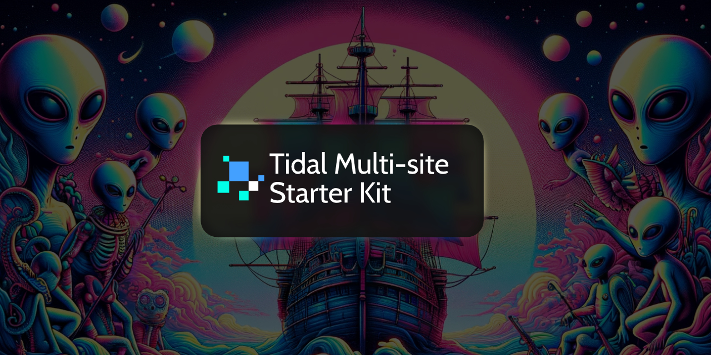

Tidal Multi-site is a free, open-source, documentation-focused starter kit for Statamic. Tidal is designed to be used as a starting point and provides the following features:

* Manage documentation for multiple software projects
* Manage documentation for multiple versions *per* project
* Statamic multi-site feature configured out-of-the-box, allowing for multiple projects, each with multiple versions, all in different languages

If you do not need to use Statamic's multi-site feature you should consider starting out with the [Tidal](https://github.com/Stillat/tidal) starter kit instead. It's default content and structure is simpler.

Happy documentation-writing!

## Installation and Documentation

Tidal's installation and documentation guide can be found online at https://stillat.com/tidal-starter-kit/v1/installation-and-upgrading

## License

Tidal Multi-site is open-source software, released under the GPL-3.0 license.
